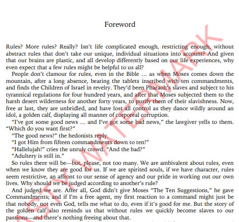
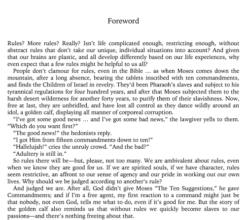

## Apply black-and-white binary scale to pdf. *(not grayscale)*  

 **-->** 
 **-->** 

### When opened for the first time: 
    $ pip install pdf2img  
    $ pip install img2pdf  
    $ pip install opencv-python  

**Windows users** will also have to build or download poppler for Windows. 
Download here: https://github.com/oschwartz10612/poppler-windows/releases/ 
After you unpack it, add the "bin/" folder to PATH 
How to add folders to PATH: https://www.architectryan.com/2018/03/17/add-to-the-path-on-windows-10/ 

### FOR EVERYONE: 
You can adjust the threshold by changing **the first number in brackets in line 39** (*with higher values more content will result black*) 
I am glad to recieve your feedback about this project. 
**Enjoy :3**
